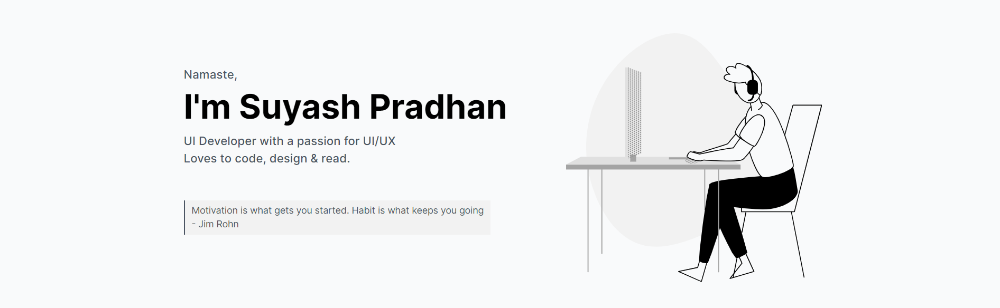

### Connect with me:
 [][linkedin] [][twitter] [][dribbble] [][hashnode]  [][instagram] 

- 🔭 <b>Working</b>: JavaScript and ReactJS.
- 🌱 <b>Learning</b>: MERN Stack.
- 💬 <b>Ask</b>: About Front-End Development, Web-Design, UI/UX.
- 👯 <b>Collaborate</b>: With other Developers.
- 🥅 <b>2021 Goals</b>: Contribute to Open Source projects.
- ⚡ <b>Fun fact</b>: I love to read books and play video games.
### Languages :
             

---

### Tools: 

     

---

---

[website]: https://suyashportfolio.netlify.app
[twitter]: https://twitter.com/SuyashPradhan9
[instagram]: https://www.instagram.com/suyashpradhan7/
[linkedin]: https://www.linkedin.com/in/suyashpradhan/
[dribbble]: https://dribbble.com/suyashpradhan
[hashnode]: https://blog.suyashpradhan.me/

